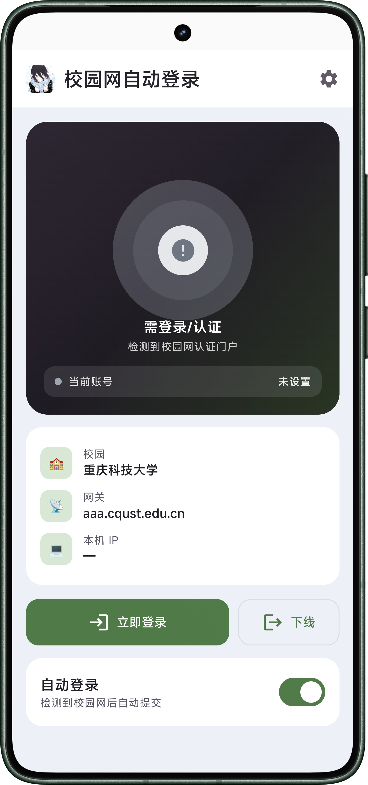
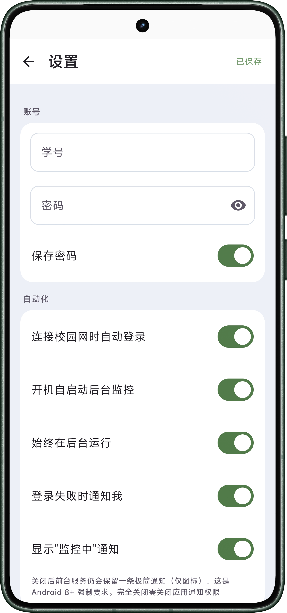
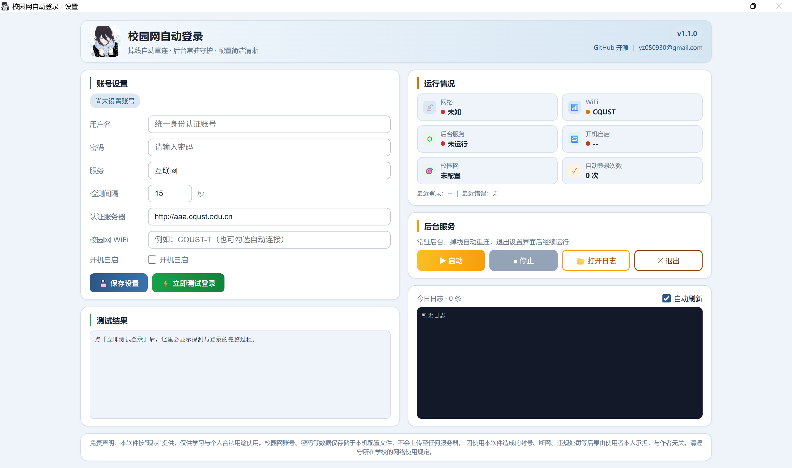

# Campus Auto-Login 校园网自动登录

[中文](README.md) | **English**

> An auto-relogin campus network authenticator for Windows & Android, built for the Ruijie ePortal gateway (e.g. CQUST).

- Repository: <https://github.com/Zelm05/campus-autologin>
- Contact: yz050930@gmail.com

## Download

Installers are in [`release/`](release/):

| Platform | File | Notes |
| --- | --- | --- |
| Android | `release/Autologin-v1.0.1_release.apk` | Install directly; overwrite keeps your credentials |
| Windows | `release/Autologin_v1.1.0_x64_setup.exe` | No admin required; in-place upgrade supported |

> New Android APKs are also built automatically via GitHub Actions: push a `v*` tag to get a signed APK from the Release page.

## Project layout

```
campus-autologin/
├── .github/workflows/      # CI: builds signed APK & publishes Release on v* tags
├── .gitignore              # excludes signing keys / build outputs / wheels
├── app/                    # Android app (Kotlin + Jetpack Compose)
├── windows/
│   └── source/             # Windows desktop app (Python + pywebview)
│       ├── app.py · campus_core.py · daemon.py · gui.py · config.json
│       ├── requirements.txt · README.md · 使用说明.txt · 启动设置.bat · 重建说明.txt
│       └── build/          # packaging: CampusLogin.spec · icon.ico · setup.iss · version_info.txt
├── release/                # downloadable installers (APK / EXE)
├── screenshots/            # UI screenshots for the README
├── build.gradle.kts        # root build script
├── settings.gradle.kts     # Gradle settings
├── gradle.properties       # Gradle global properties
├── LICENSE                 # MIT license
├── CHANGELOG.md            # version history
├── README.md               # Chinese readme
└── README_EN.md            # this file
```

## Screenshots

<<<<<<< HEAD
| 📱 Android · main | 📱 Android · settings | 💻 Windows v1.1.0 |
| --- | --- | --- |
|  |  |  |

## Features

| Feature | Android | Windows |
| --- | :---: | :---: |
| One-tap login / logout | Yes | Yes |
| Auto re-login on disconnect | Yes | Yes (background daemon) |
| Start on boot | Optional | Optional |
| Credentials stored locally, encrypted | Keystore | local config.json (obfuscated) |
| Dual network (WiFi + 5G) | Yes (socket-level binding) | — |
| Persistent monitor notification | Toggleable | background daemon |

## Android

Built for the Chongqing University of Science & Technology (Ruijie ePortal) gateway. Campus network parameters are built in.

- Minimum Android 7.0 (API 24), Kotlin + Jetpack Compose + OkHttp
- Pull-to-refresh / auto network-state refresh / re-login after browser logout / 5-min cooldown after manual logout
- See `app/` source for details

### Build locally

```bash
# JDK 17+; Android SDK (platform-34 + build-tools 34.0.0)
gradle assembleRelease   # output: app/build/outputs/apk/release/app-release.apk
```

### Signing & CI

- Release signing is configured via `keystore.properties` (gitignored, not committed) referencing a local `campus_release.keystore`
- CI (`.github/workflows/`) restores the key from repository Secrets and builds a signed APK + Release on every `v*` tag

## Windows

Python + pywebview (WebView2) desktop app with a silent background daemon that reconnects on drop.

- Source & packaging docs: `windows/source/README.md` and `windows/source/重建说明.txt`
- Dependencies: `windows/source/requirements.txt` (`pip install -r` to reproduce)
- Installer needs no admin rights; in-place upgrade supported
=======
| 📱 Android v1.0.1 | 💻 Windows v1.1.0 |
| --- | --- |
|   |  |
>>>>>>> d39d42cf7630caba87bb487ff098d7f0239f7b24

## Privacy

- Android: credentials stay on-device (Android Keystore encryption); the only network target is the campus gateway
- Windows: credentials stay in the local `config.json` , never uploaded
- This repository contains no personal data and no signing private key

## Disclaimer

1. This software is provided "as is" for **personal, legal use only**; please follow your school's network usage policy.
2. Credentials are stored **only on your device** (Android Keystore / local config.json) and are **never uploaded to any server** (the only network target is the campus auth gateway).
3. Any account suspension, network bans or policy violations resulting from use of this software are the user's own responsibility.
4. Do not use this software for commercial or illegal purposes.

## License

MIT License. See [LICENSE](LICENSE).
